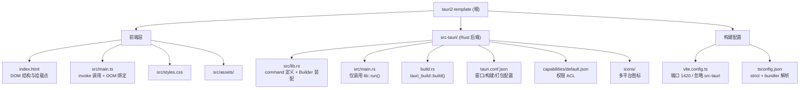

# tauri2-template — Tauri v2 + Vanilla TS 桌面应用脚手架

## 项目愿景

`tauri2-template` 是一个已验证可构建的 Tauri v2 桌面应用起点，为后续 Rust 桌面项目提供：

- 干净的 Rust 后端分层（`lib.rs` 承载业务与 Builder，`main.rs` 仅作入口）
- 已跑通的前后端 IPC 链路（`#[tauri::command]` ↔ `invoke`）
- Tauri v2 的权限模型（capabilities ACL）已就位
- 已实测的 Windows 工具链组合（MSVC 2017 + WebView2 + Rust 1.98.1 可完成链接）
- 国内网络环境下的依赖加速（cargo 走清华 TUNA 镜像）

刻意保持**无前端框架**：前端是 Vanilla TS + Vite，重心放在 Rust 侧。需要 React/Vue 时再自行接入。

## 架构总览

- 后端：Rust 1.98.1（edition 2021），crate `tauri2-template`，lib 名 `tauri2_template_lib`。
- 前端：Vanilla TypeScript 7 + Vite 8，无框架、无路由、无状态库。
- 通信：Tauri v2 IPC — Rust 侧 `#[tauri::command]` 注册到 `invoke_handler`，前端 `invoke("name", args)` 调用。
- 权限：`src-tauri/capabilities/default.json` 显式授权，未列出的能力运行时被拒。
- 构建：`pnpm tauri dev` / `pnpm tauri build`，前端产物 `dist/` 由 `tauri.conf.json` 的 `frontendDist` 指向。

通信链路：

```
index.html (#greet-form / #greet-input / #greet-msg)
    └── src/main.ts: invoke("greet", { name })
        └── [IPC + capabilities ACL 校验]
            └── src-tauri/src/lib.rs: #[tauri::command] fn greet(name: &str)
                └── 注册点：invoke_handler(tauri::generate_handler![greet])
```

## 模块结构图



## 模块索引

| 模块 | 路径 | 语言/技术 | 一句话职责 |
|------|------|-----------|------------|
| 应用入口 | [src-tauri/src/main.rs](src-tauri/src/main.rs) | Rust | 仅调用 `tauri2_template_lib::run()`，不放业务代码 |
| 业务与装配 | [src-tauri/src/lib.rs](src-tauri/src/lib.rs) | Rust | `#[tauri::command]` 定义、插件注册、Builder 装配 |
| 构建脚本 | [src-tauri/build.rs](src-tauri/build.rs) | Rust | `tauri_build::build()`，生成 ACL schema 与资源 |
| 应用配置 | [src-tauri/tauri.conf.json](src-tauri/tauri.conf.json) | JSON | 窗口、标识符、前端产物路径、打包目标 |
| 权限 ACL | [src-tauri/capabilities/default.json](src-tauri/capabilities/default.json) | JSON | 声明 main 窗口可用的权限集合 |
| 前端入口 | [index.html](index.html) | HTML | DOM 结构，Vite 的构建入口 |
| 前端逻辑 | [src/main.ts](src/main.ts) | TypeScript | `invoke` 调用后端、绑定 DOM 事件 |
| 前端构建 | [vite.config.ts](vite.config.ts) | TypeScript | 固定端口 1420、忽略 `src-tauri` 监听 |

## 运行与开发

前置条件：Rust 1.98.1+（MSVC toolchain）、Node.js、pnpm、MSVC 构建工具、WebView2 运行时。

| 命令 | 说明 |
|------|------|
| `pnpm install` | 首次或依赖变更后安装前端依赖 |
| `pnpm tauri dev` | 前后端联调，Rust 改动自动重编译 |
| `pnpm tauri build` | 生产构建并产出安装包 |
| `pnpm build` | 仅前端构建（`tsc && vite build` → `dist/`） |
| `pnpm dev` | 仅 Vite 开发服务器（无 Rust 窗口，仅调 UI 时用） |
| `cargo check` | Rust 快速类型检查（在 `src-tauri/` 下执行，不链接） |
| `cargo build` | Rust 完整构建含链接（在 `src-tauri/` 下执行） |
| `pnpm tauri info` | 输出环境诊断（排查工具链问题第一步） |
| `pnpm tauri add <plugin>` | 添加官方插件（会同时改 Cargo.toml 与 package.json） |

## 改名 / 业务化指南

项目名出现在 5 处，改名需同步，否则编译失败或产物名不一致：

1. [package.json](package.json#L2) 的 `name`
2. [src-tauri/Cargo.toml](src-tauri/Cargo.toml#L2) 的 `[package].name`
3. [src-tauri/Cargo.toml](src-tauri/Cargo.toml#L14) 的 `[lib].name`（须为合法 Rust 标识符，用下划线）
4. [src-tauri/src/main.rs](src-tauri/src/main.rs#L5) 的 crate 引用，须与第 3 步一致
5. [src-tauri/tauri.conf.json](src-tauri/tauri.conf.json#L3) 的 `productName` 与窗口 `title`

另外 `tauri.conf.json` 的 `identifier` 必须改成你自己的反向域名（当前为 `com.tauri2template.dev`）。它决定应用数据目录与系统注册标识，**发布前必须改**，且不要以 `.app` 结尾。

## 权限模型（Tauri v2 与 v1 的关键差异）

v2 用 capabilities ACL 取代了 v1 的 allowlist。[src-tauri/capabilities/default.json](src-tauri/capabilities/default.json) 当前授予 `core:default` 与 `opener:default`。

**加插件必须同时加权限**，否则前端调用在运行时被拒（编译期不报错）：

```
1. pnpm tauri add <plugin>          # 加依赖
2. lib.rs 里 .plugin(<plugin>::init())  # 注册
3. capabilities/default.json 加 "<plugin>:default"  # 授权 ← 最易遗漏
```

详见 `.claude/skills/tauri2-config-permissions/SKILL.md`。

## 测试策略

当前仓库无测试代码。建议：

- Rust：`src-tauri/src/lib.rs` 内 `#[cfg(test)] mod tests`，纯逻辑函数直接 `cargo test`。command 函数体应尽量瘦，把逻辑下沉到可单测的普通函数。
- 前端：无框架，建议 Vitest 覆盖纯函数；涉及 `invoke` 的部分 mock `@tauri-apps/api/core`。
- 端到端：Tauri 官方推荐 WebDriver（tauri-driver）。

## 编码规范

- Rust：`cargo fmt`、`cargo clippy`。command 函数保持瘦，业务逻辑放独立模块。
- 前端：TypeScript `strict: true`，且开了 `noUnusedLocals` / `noUnusedParameters` —— 未使用的变量会**直接构建失败**，不是警告。
- `querySelector` 在 strict 下返回可能为 null，必须判空（见 [src/main.ts](src/main.ts#L7)）。
- 文件路径：仓库内统一正斜杠。

## AI 使用指引

- **分层准则**：业务逻辑与 command 写在 [src-tauri/src/lib.rs](src-tauri/src/lib.rs)（或其拆出的子模块）。[src-tauri/src/main.rs](src-tauri/src/main.rs) 只允许存在 `run()` 调用，**不接受任何业务代码追加**。
- **command 铁律**：新增 `#[tauri::command]` 必须同步注册进 `tauri::generate_handler![]`，漏注册时前端调用报 "command not found"，而 Rust 侧编译通过 —— 这是本模板最易犯的错。
- **权限铁律**：任何插件能力在前端可用前，必须在 `capabilities/default.json` 显式列出。编译期不会提醒你。
- **IPC 参数命名**：前端传 camelCase，Rust 侧收 snake_case，Tauri 自动转换。Rust 侧不要为了迁就前端而写 camelCase 参数名。
- **错误传递**：command 返回 `Result<T, E>` 时 `E` 必须实现 `serde::Serialize`，否则编译失败。裸 `anyhow::Error` 不能直接返回，需转成 `String` 或自定义错误类型。
- **禁止硬编码 devUrl**：前端不要写死 `http://localhost:1420`。端口由 [vite.config.ts](vite.config.ts#L15) 与 [src-tauri/tauri.conf.json](src-tauri/tauri.conf.json#L8) 两处约定，改动须同步。
- **不要让 Vite 监听 src-tauri**：[vite.config.ts](vite.config.ts#L27) 已忽略，移除会导致 Rust 重编译触发前端无限刷新。
- **CSP 当前为 null**：[src-tauri/tauri.conf.json](src-tauri/tauri.conf.json#L22) 关闭了内容安全策略，方便开发但生产不安全。接入远程内容或第三方脚本前必须配置 CSP。
- **withGlobalTauri 为 true**：`window.__TAURI__` 可用。它扩大了前端攻击面，若不需要全局注入建议关掉，改用 ESM import。
- **依赖镜像**：cargo 走清华 TUNA 镜像（配置在用户级 `~/.cargo/config.toml`，不在仓库内）。换机器需自行配置，否则首次构建可能极慢。

## Go 并发迁移与 Rust 实践

Foundation 的并发语义可以借鉴，但不要把 Go runtime/API 机械翻译成 Rust：

| Foundation（Go）事实 | 当前 Rust 实现 / 差异 |
|---|---|
| `procx` 用 goroutine 读 stdout/stderr，`sync.WaitGroup` 收尾；`context.Context`/`Done()` 触发停止；process `doneCh` 通知完成。Wails subprocess service 调用 `StartCtx(context.Background(), ...)`，所以 IPC 调用 context 不拥有进程生命周期，用户须显式 Stop。 | 子进程由 `std::thread::spawn` reader 与独占 `Child` 的 worker 管理，`JoinHandle` 放入 `background_tasks`；`AtomicBool` 是协作停止标志，不会自动取消线程。生命周期 gate 在 shutdown 后拒绝迟到的 subprocess 注册；`ready` event 先于 worker 启动发出；完成的 `JoinHandle` 会被清理。前端流通过 Tauri events，不是 Go channel 的直接移植。[src-tauri/src/subprocess.rs](src-tauri/src/subprocess.rs#L92-L187) [src-tauri/src/state.rs](src-tauri/src/state.rs#L82-L108) [src-tauri/src/events.rs](src-tauri/src/events.rs#L16-L34) |
| 状态用 `Mutex` / `RWMutex` / atomic；服务以锁保护进程 map 和递增 ID。 | 使用 `Mutex`、`RwLock`、`AtomicBool`、`AtomicU64`；rusqlite `Connection` 由 `Arc<Mutex<Connection>>` 串行访问。子进程每个输出流的快照最多 256 行；单行最多 1 MiB，超限追加截断标记；退出历史最多 64 项。[src-tauri/src/state.rs](src-tauri/src/state.rs#L13-L20) [src-tauri/src/state.rs](src-tauri/src/state.rs#L27-L57) [src-tauri/src/subprocess.rs](src-tauri/src/subprocess.rs#L145-L166) |
| Go Windows 用 JobObject + `KILL_ON_JOB_CLOSE`，Unix 用独立 pgid，取消时先优雅停、宽限后强杀。 | Rust Unix 用 `setsid`/进程组，先 SIGTERM 后 SIGKILL；Windows 也绑定 JobObject + `KILL_ON_JOB_CLOSE`，但在 spawn 后绑定，存在竞态，失败时退化到 taskkill。worker 有 5 秒优雅期和 2 秒强杀等待上限；强杀后会 reap child；reader shutdown 最多等待 2 秒，超时发出最后手段 detach warning。应用退出会拒绝迟到注册并清理已完成 `JoinHandle`，但 Unix runtime 尚未验证。[src-tauri/src/subprocess.rs](src-tauri/src/subprocess.rs#L190-L237) [src-tauri/src/process_group.rs](src-tauri/src/process_group.rs#L105-L162) [src-tauri/src/process_group.rs](src-tauri/src/process_group.rs#L164-L233) [src-tauri/src/state.rs](src-tauri/src/state.rs#L82-L108) |
| `httpx` 是共享 `net/http` client，30 秒 context deadline；默认不重试，显式 `Retry` 才启用。`MaxAttempts` 含首次请求（<=0 规范化为 1）；默认 base delay 200ms、上限 5s，指数退避 ±25% 抖动；取消/超时不重试，HTTP 408/429/5xx 与其他网络错误可重试。 | `reqwest::blocking` 共享 client，默认 30 秒超时、8 MiB 响应上限；`max_retries` 是初次请求后的重试次数（默认 0），base delay 200ms/上限 5s；只重试幂等方法，状态规则含 408/425/429/5xx 与 transport 错误。`CancellationToken` 在请求前、退避期间检查；运行中的阻塞请求不被 token 立即打断，只受请求超时限制；当前实际退避传入固定 jitter 样本 1.0，并非随机抖动。[src-tauri/src/utils/httpx.rs](src-tauri/src/utils/httpx.rs#L45-L60) [src-tauri/src/utils/httpx.rs](src-tauri/src/utils/httpx.rs#L261-L300) |
| `logx` 用 `slog` 和互斥轮转 writer，默认 8 MiB、3 个备份；`filex.WriteAtomic` 同目录临时文件、fsync、rename。 | `RotatingFileSink` 以 `Mutex` 串行写 JSONL，默认 8 MiB/3 份并对常见凭据标签脱敏；`filex::write_atomic` 用唯一同目录临时文件、sync、原子替换，目录 sync 尽力而为。[src-tauri/src/utils/logx.rs](src-tauri/src/utils/logx.rs#L101-L190) [src-tauri/src/utils/filex.rs](src-tauri/src/utils/filex.rs#L47-L82) |

**迁移取舍：**直接复用“所有权清晰、显式取消、有限超时、有限缓冲、幂等重试、配置原子替换、日志轮转”的设计意图；用 Rust 原语和 Tauri event 契约适配 Go goroutine/context/WaitGroup/channel。Foundation 的 AES-GCM 安全目标在 Rust `cryptox` 以 AES-256-GCM + 用户数据目录主密钥实现，不是并发 API 的移植。[src-tauri/src/utils/cryptox.rs](src-tauri/src/utils/cryptox.rs#L1-L25) 当前不迁移 `GOMAXPROCS`、`runtime.LockOSThread` 或 server 专用 build tags：Foundation 源码未使用前两者，也没有 server 构建分支；已有 `//go:build` 是 Windows/Unix 与窗口/托盘等平台分支，Rust 仅在需要处用 `cfg(target_os)`。本项目没有 Rayon；不要为复刻 Go 调度器预设线程数，只有 CPU 密集任务经测量确认后才考虑 Rayon。

**实施规则：**async command 不直接执行 `std::fs`、`std::thread::sleep`、`reqwest::blocking`、长时间 SQLite/其他阻塞 I/O；选择 `tauri::async_runtime::spawn_blocking` 做有限阻塞工作、专用且受管理的线程做长生命周期读写/进程监视、Rayon 做可分块 CPU 密集工作、受白名单约束的子进程做外部工具。同步 command 只用于有界且短小的工作。不得持有 `std::sync::{MutexGuard, RwLockReadGuard, RwLockWriteGuard}` 跨 `.await`；先克隆所需数据并释放 guard。停止和应用退出必须有取消信号、明确宽限期/强制终止策略及有界等待；reader shutdown 的 2 秒上限、最后手段 detach warning、late-registration gate、ready-before-worker 顺序、force termination reap 和 completed `JoinHandle` pruning 都属于可观察契约。当前剩余平台风险是 Windows JobObject attach 的 post-spawn race/taskkill fallback，以及 Unix runtime 尚未验证。Foundation 的通用 `context`、`KillGracePeriod`、stdin、env、`CaptureOutput` 能力未作为当前 Tauri contract 暴露；需要时应设计显式 typed contract，不要假定 IPC 已等价。

## 已验证事实（勿凭猜测推翻）

- Tauri 2.12.0 / tauri-build 2.7.0 / tauri-plugin-opener 2.7.0 均为当前最新稳定版。
- MSVC Build Tools 2017（14.16）+ Windows SDK 10.0.19041 可完成链接，**不必**升级 VS 2022。
- `cargo check` 不做链接，验证工具链完整性必须跑 `cargo build`。
- `generic-array` / `toml` / `toml_datetime` / `toml_edit` 落后于最新版，是 Tauri 上游（`system-deps`、`sha2`）的约束，非本项目问题，不要强行 `--precise` 绕过。
- `pnpm-workspace.yaml` 是 pnpm 发布时间门禁自动生成的例外记录，删除可能导致 plugin-opener 回退到 2.6.0。

## 变更记录 (Changelog)

- 2026-09-30：初始化项目。生成 Tauri v2 vanilla-ts 模板；安装 Rust 1.98.1 MSVC 工具链；统一命名为 `tauri2-template`；配置 cargo 清华镜像；验证 `cargo build` 可链接（13MB exe）。
- 2026-09-30（依赖更新）：TypeScript 6.0.3 → 7.0.2（跨大版本，经隔离实测通过）；`@tauri-apps/plugin-opener` 2.6.0 → 2.7.0，与 Rust 侧版本对齐。Tauri 核心确认已是最新稳定版，未升级至 3.0.0-alpha 预发布版。
- 2026-09-30（文档）：初始化 CLAUDE.md 与 `.claude/skills/` 开发技能库。
- 2026-09-30（官方 references）：从 `tauri-apps/tauri-docs` 的 `v2` 分支（commit `fb135dc6f6894c62ba41a04128e9cb05564a9b7a`）同步 29 份 Tauri 官方 `.md/.mdx` 原文到五个 skill 的 `references/` 目录，并保留 MIT 来源说明。
- 2026-10-01（foundation 迁移）：完成 Rust-first Foundation Desktop 工作台迁移：Vanilla TS 壳、主题/i18n、Home/Settings/X-Pro/Subprocess 页面、rusqlite 新 schema、typed IPC、dialog/tray/child windows、受限 subprocess、AES-GCM/http/log/file 工具层；通过 `pnpm build`、30 项 Rust 测试、`cargo check/build` 和 MSI/NSIS 打包。详见 `docs/explore-develop/2026-10-01-2128-foundation-migration.md`。
